

  <a href="https://github.com/husei932/ESUAVP">
    <picture>
      <source media="(prefers-color-scheme: dark)" srcset="./logw.png">
      <source media="(prefers-color-scheme: light)" srcset="./logo.png">
      
    </picture>
  </a>

<h1 align="center">ESUAVP — Контроллер БПЛА на ESP32-S3</h1>

  
  
  
  

  <b>NEO-M8N GPS · LSM6DS3 IMU · LIS3MDL магнитометр · понижающий DC-DC 3.3 В</b>

---

## Описание

Открытый контроллер для беспилотных летательных аппаратов на базе **ESP32-S3**. Проект включает кастомную многослойную PCB со встроенными модулями навигации, ориентации и стабилизированным питанием — готовая основа для мультикоптеров, самолётов и экспериментальных платформ.

## Аппаратная часть

| Компонент | Модель | Назначение |
|-----------|--------|------------|
| МК | ESP32-S3-WROOM-1 | Основной контроллер |
| GPS | NEO-M8N | Навигация, координаты, высота |
| IMU | LSM6DS3 | Гироскоп + акселерометр (I2C) |
| Магнитометр | LIS3MDL | Ориентация по магнитному полю (SPI) |
| DC-DC | LM2679SD-3.3 | Понижающий преобразователь 3.3 В |
| LDO | LT1963A-3.3 | Линейный стабилизатор чистого 3.3 В |
| ESD-защита | USBLC6-2SC6 + 3× ESD224DQA | Защита USB и сигнальных линий |
| ON/OFF | MAX16054AZT | Контроллер включения с дебаунсом |
| P-MOSFET | CSD25402Q3A | Коммутация питания |

---

## Схемотехника

Схема разбита на 5 листов (KiCad 9.0.6):

### Лист 1 — Верхний уровень

Иерархическая структура проекта из четырёх блоков: **MCU (ESP32-S3)**, **GPS NEO**, **Measurements Units** и **Power Supply**. Каждый блок вынесен в отдельную субсхему.

  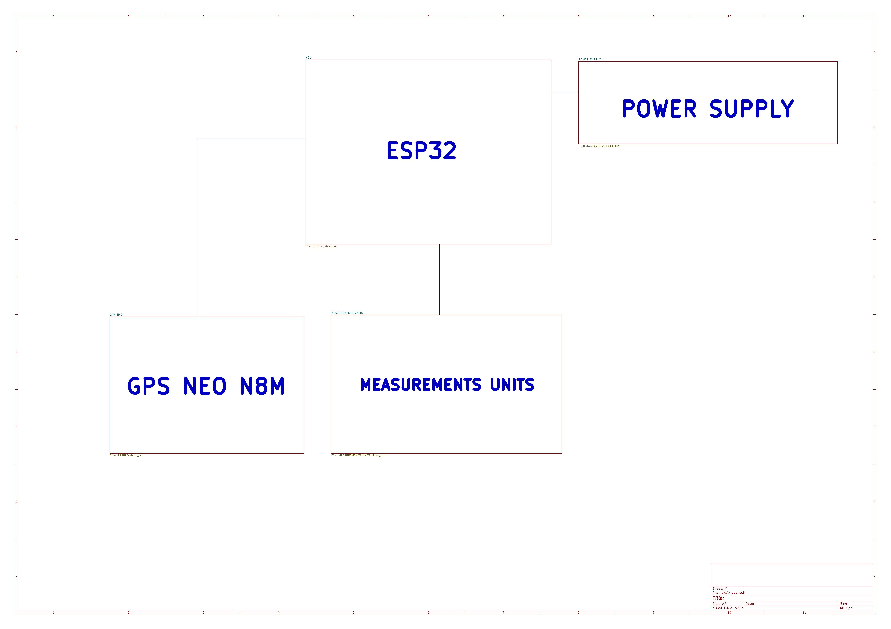

### Лист 2 — MCU

Центральный блок — модуль **ESP32-S3-WROOM-1** (U7). USB-C разъём (J1, 14-пиновый) подключён через ESD-защиту USBLC6-2SC6 (U3) на линиях D+/D−, с двумя резисторами 5.1 кОм на CC1/CC2 для определения устройства. Три дополнительных ESD-чипа ESD224DQA (U2, U14, U15) защищают сигнальные разъёмы J3, J6 и J7 (4-пиновые коннекторы). Кнопка EN (SW4) с подтяжкой 10 кОм и RC-фильтром отвечает за аппаратный сброс, кнопка BOOT (SW3) — за вход в режим загрузки. На линиях USB стоят резисторы 22 Ом (R18, R19) для согласования импеданса. Развязка по питанию: 0.1 мкФ на 3.3 В, 22 мкФ на входе. Резисторы R15/R16 помечены как подбираемые после изготовления PCB в зависимости от ёмкости шины.

  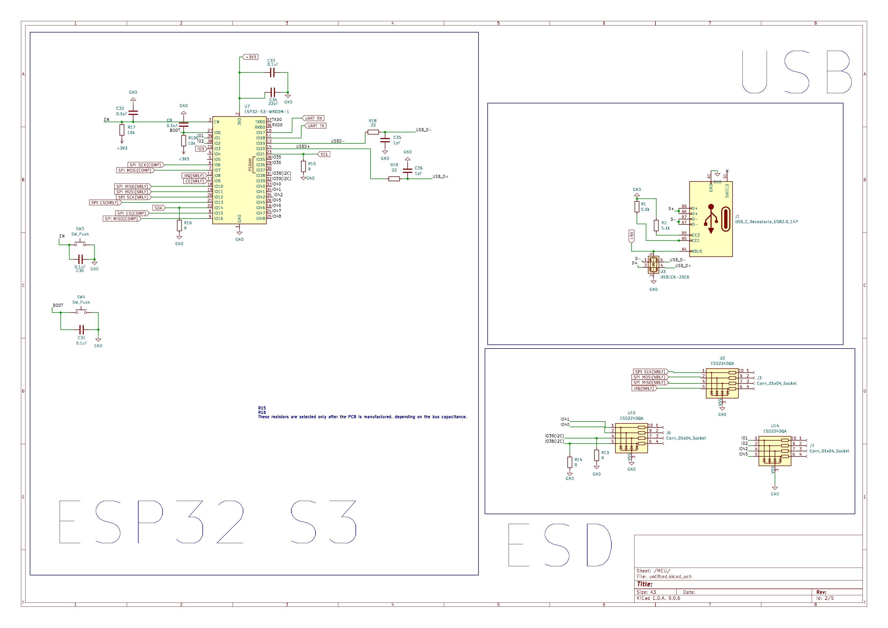

### Лист 3 — GPS NEO-M8N

Модуль **NEO-M8N** (U1) подключён к ESP32 по UART (TX/RX) через токоограничивающие резисторы 22 Ом (R7, R8). RF-вход идёт через коаксиальный разъём J2 и ферритовый бид 27 нГн (FB2) с фильтрующим конденсатором 10 нФ (C4) и резистором 10 Ом (R20). Питание модуля: VCC через развязку 0.1 мкФ (C15) + 10 мкФ (C16), подтяжка RESET через 10 кОм (R6). Линии USB модуля (USB_DM/USB_DP) выведены, но в основном используется UART-интерфейс.

  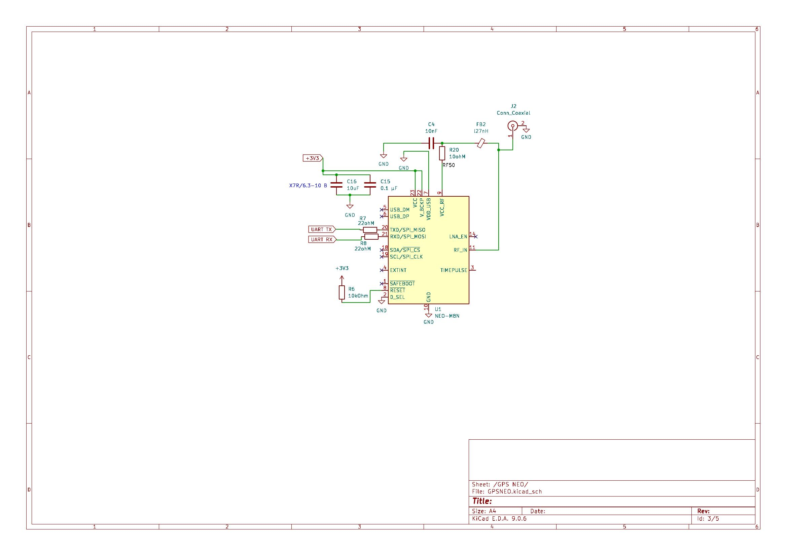

### Лист 4 — Питание (Power Supply)

Двухступенчатая система питания:

**Первая ступень** — понижающий DC-DC **LM2679SD-3.3** (U5) с входным напряжением VBUS. Индуктивность 22 мкГн (L2), диод Шоттки D2, выходная ёмкость 180 мкФ (C22) + 180 мкФ (C23). Буст-конденсатор 0.01 мкФ (C21) для внутреннего драйвера. Софт-старт через конденсатор 1 нФ (C20) на SS-пине. Обратная связь через делитель R9 (82 кОм) / R10 (360 кОм). Резистор 5.6 кОм (R3) на CL_Adj задаёт ограничение тока.

**Вторая ступень** — LDO **LT1963A-3.3** (U4) для чистого аналогового 3.3 В с входной ёмкостью 10 мкФ × 2 (C1, C2) и выходной фильтрацией.

**Управление включением** — контроллер **MAX16054AZT** (IC1) обеспечивает дебаунс кнопки ON/OFF (SW1) и управляет P-MOSFET **CSD25402Q3A** (U8) через резисторные подтяжки R4/R11 (100 кОм). Тестовые точки: TP1 (3.3 В), TP4 (VBUS), TPGND1 (земля).

  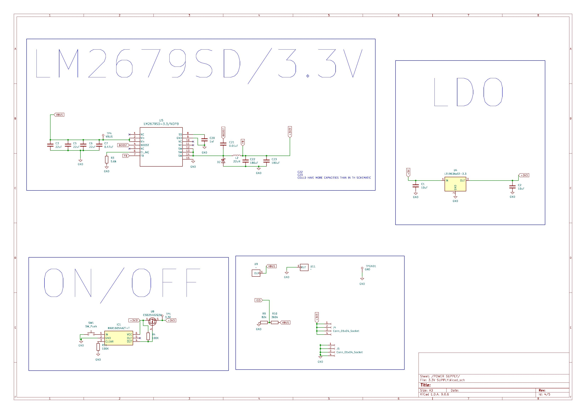

### Лист 5 — Датчики (Measurements Units)

**LSM6DS3** (U13) — 6-осевой IMU (гироскоп + акселерометр), подключён по I2C (SDA/SCL). Развязка: 100 нФ на VDDIO (C18) и VDD (C9), дополнительные 100 нФ (C10, C12). Линии INT1/INT2 выведены, SDO/SA0 задаёт адрес на шине.

**LIS3MDL** (U6) — 3-осевой магнитометр, подключён по SPI (CS, SCK, SDI/SDO). Развязка: 100 нФ на Vdd (C19) и Vdd_IO, 1 мкФ (C11) для дополнительной фильтрации. Линии DRDY и INT выведены для прерываний.

  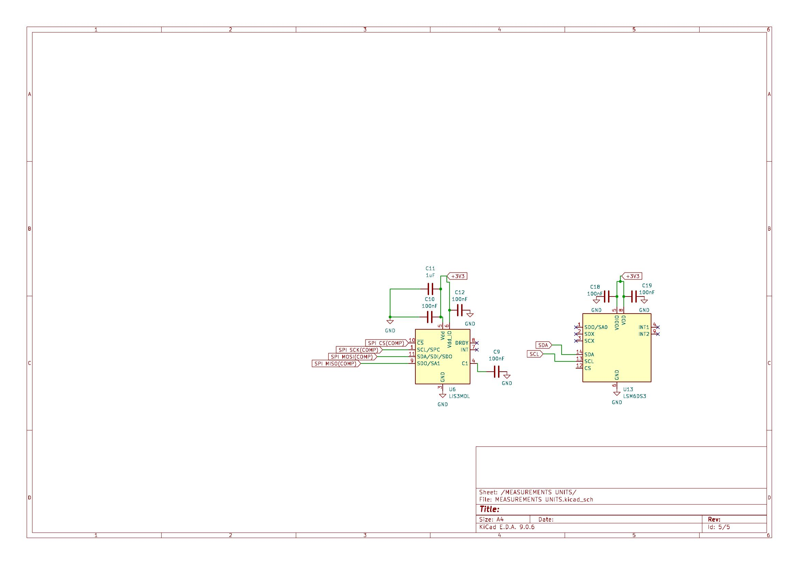

---

## Печатная плата (PCB)

### Общий вид

  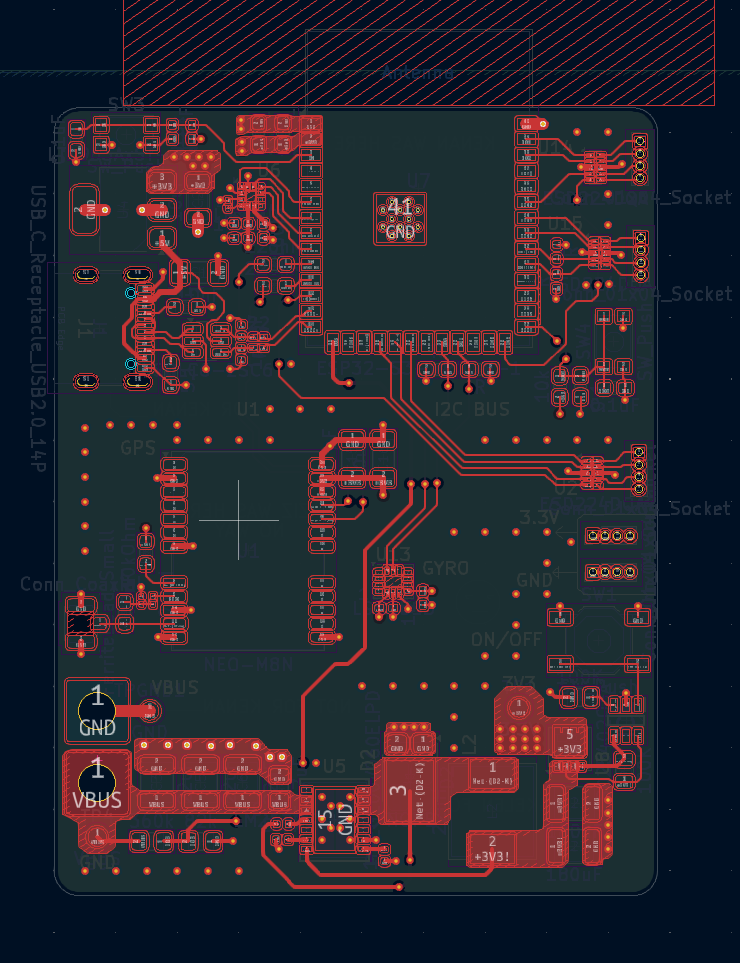

### Стекап

Многослойная PCB (6 медных слоёв + сервисные):

| № | Слой | Назначение |
|---|------|------------|
| 1 | F.Silkscreen | Маркировка компонентов (лицевая) |
| 2 | F.Paste | Паяльная паста (лицевая) |
| 3 | F.Mask | Паяльная маска (лицевая) |
| 4 | **sig1.Cu** | Сигнальный слой 1 (лицевой) |
| 5 | **GND1.Cu** | Сплошной полигон земли |
| 6 | **3.3V.Cu** | Плейн питания 3.3 В |
| 7 | **sig2.Cu** | Сигнальный слой 2 (внутренний) |
| 8 | **GND2.Cu** | Второй полигон земли |
| 9 | **gnd.Cu** | Земля (тыльный) |
| 10 | B.Mask | Паяльная маска (тыльная) |
| 11 | B.Paste | Паяльная паста (тыльная) |
| 12 | B.Silkscreen | Маркировка компонентов (тыльная) |
| — | Edge.Cuts | Контур платы |

### Слои PCB

<b>F.Silkscreen — лицевая маркировка</b>

  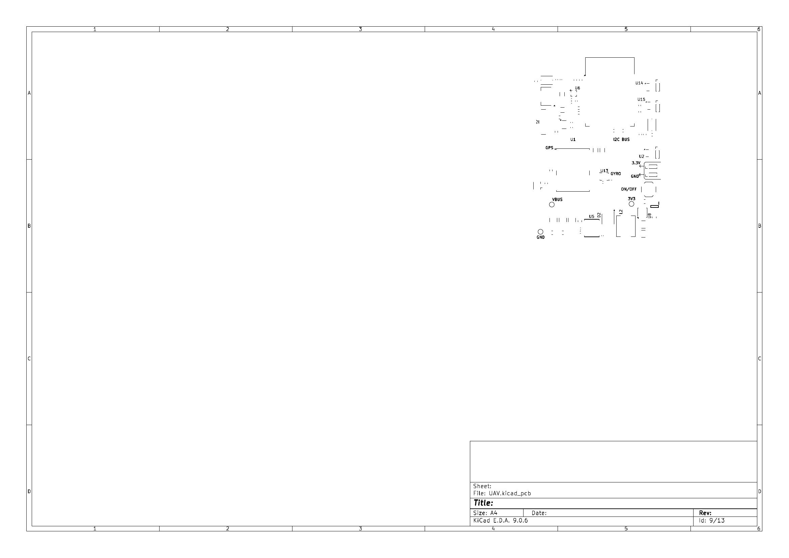

<b>sig1.Cu — сигнальный слой 1 (лицевой)</b>

  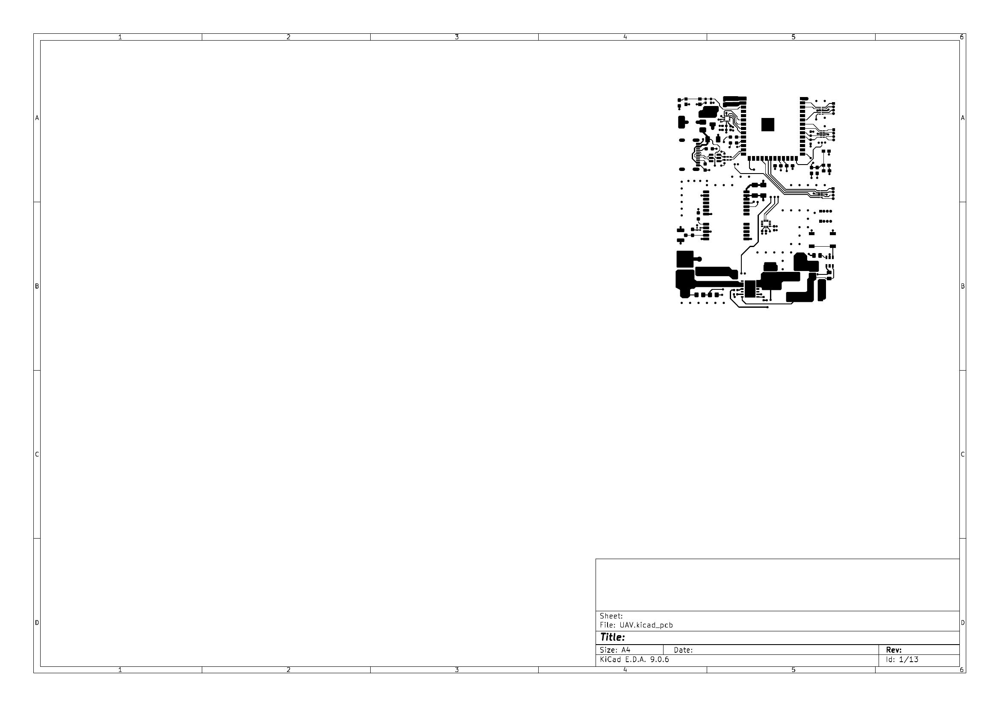

<b>GND1.Cu — полигон земли 1</b>

  

<b>3.3V.Cu — плейн питания</b>

  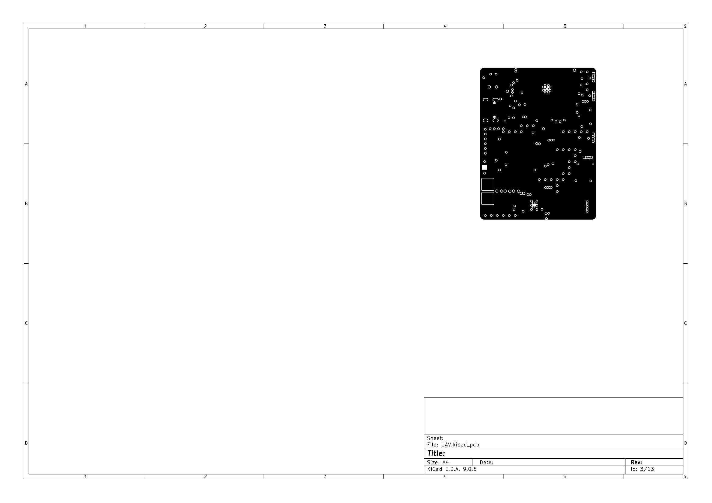

<b>sig2.Cu — сигнальный слой 2</b>

  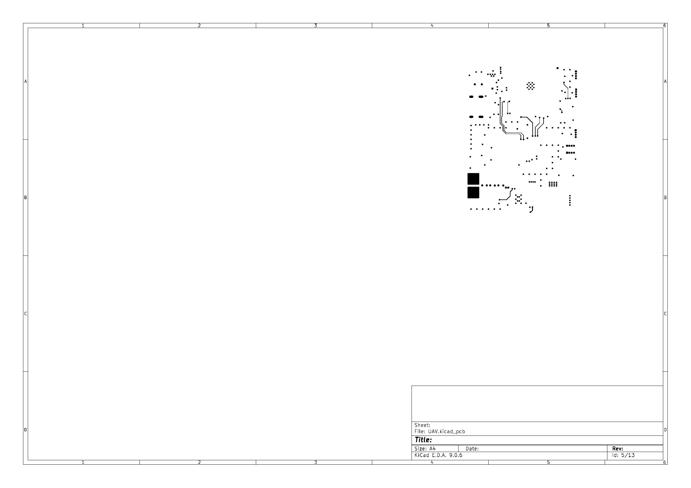

<b>GND2.Cu — полигон земли 2</b>

  

<b>gnd.Cu — земля (тыльный)</b>

  

<b>B.Silkscreen — тыльная маркировка</b>

  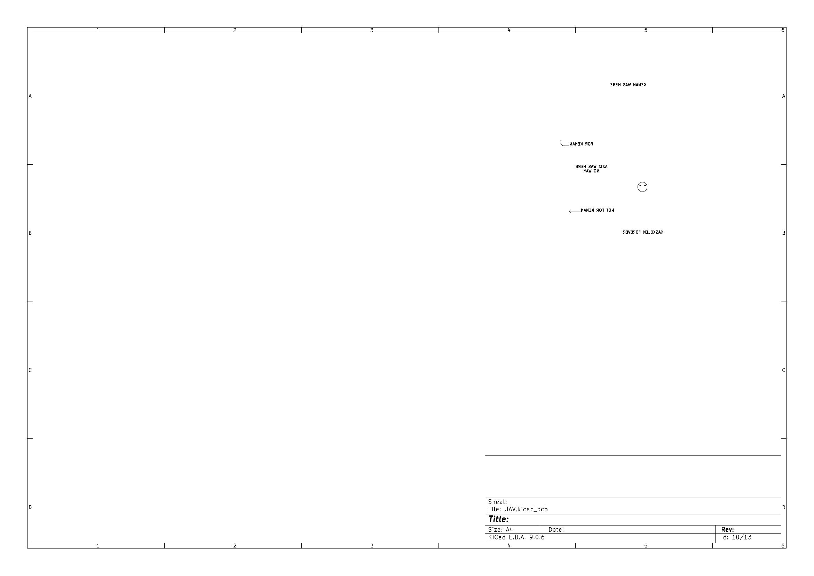

<b>Edge.Cuts — контур платы</b>

  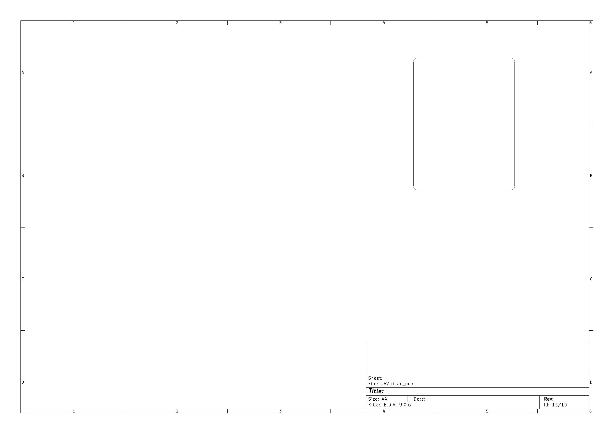

### Расположение компонентов

Плата скомпонована по функциональным зонам:

- **Левый нижний угол** — USB-C разъём (J1) с ESD-защитой и CC-резисторами
- **Центр-лево** — GPS-модуль NEO-M8N (U1) с коаксиальным разъёмом антенны
- **Центр** — ESP32-S3-WROOM-1 (U7) с обвязкой
- **Правый центр** — IMU (LSM6DS3) и шина I2C
- **Нижняя часть** — силовой блок: DC-DC (U5), индуктивность (L2), LDO (U4), электролиты
- **Правая сторона** — разъёмы (J3, J6, J7), кнопка ON/OFF
- **Тестовые точки** — VBUS, 3.3V, GND распределены по плате

Два сплошных полигона земли (GND1, GND2) и выделенный плейн 3.3 В обеспечивают низкий импеданс цепей питания и экранирование сигнальных слоёв.

---

## Возможности

- Навигация по GPS с определением координат и высоты
- Измерение угловой скорости и ускорения (6-осевой IMU)
- Определение курса по магнитометру
- Двухступенчатое питание: DC-DC + LDO для чистого 3.3 В
- ESD-защита на всех внешних интерфейсах
- Аппаратный ON/OFF с дебаунсом (MAX16054)
- Открытая схемотехника — KiCad 9.0.6

## Статус проекта

- ✅ Архитектура спроектирована
- ✅ Схемотехника завершена (5 листов)
- ✅ PCB на стадии пре-финальной ревизии
- ⬜ Финальная верификация перед производством
- ⬜ Документация по сборке и прошивке

## Применение

- Малые БПЛА (мультикоптеры, самолёты)
- Учебные и исследовательские проекты
- DIY-сборки

## Стек

- **Язык:** C/C++
- **Фреймворк:** ESP-IDF / Arduino
- **САПР:** KiCad 9.0.6
- **Контроллер:** ESP32-S3-WROOM-1

## Документация

В планах:

- Гайд по сборке PCB
- Инструкция по настройке прошивки
- Примеры кода и тестовые кейсы
- Даташиты и BOM-лист

## Авторы

<table>
  <tr>
    <td width="120" align="center">
      
       
      <b>@whoelse091</b>
    </td>
    <td>
      <b>Роль:</b> Мейнтейнер / Hardware & Firmware 
      <b>Фокус:</b> ESP32-S3, PCB (KiCad), питание, EMC/ESD, целостность сигналов
        
      
      
      
      
      
    </td>
  </tr>
  <tr>
    <td width="120" align="center">
      
       
      <b>@Decide0</b>
    </td>
    <td>
      <b>Роль:</b> Software / Firmware 
      <b>Фокус:</b> C++, Java, Python
        
      
      
      
    </td>
  </tr>
</table>

## Лицензия

[СERN Open Hardware Licence Version 2 – Strongly Reciprocal (CERN-OHL-S v2)](https://gitlab.com/ohwr/project/cernohl/-/wikis/uploads/b236492596cfc91c12def7d50bbf7da0/cern_ohl_s_v2.pdf)
